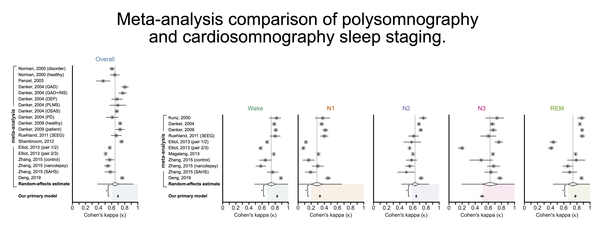

# Introduction to Cardiosomnography

We propose the term "**cardiosomnography**" (**CSG**) for any sleep study that could be conducted with only electrocardiography (ECG/EKG). In addition to expert-level sleep staging [[1](#citations)], numerous studies have demonstrated that sleep apnea detection can be reliably performed using only ECG [[2,3,4](#citations)].

# Sleep Staging with CSG

We demonstrate in our recent [paper](<https://doi.org/10.1016/j.compbiomed.2024.108545>) [[1](#citations)] that it is now possible to score sleep at equivalent performance to expert human-scored polysomnography (PSG) using only ECG. The method offers an inexpensive, automated, and convenient alternative for sleep stage classification—further enhanced by a real-time scoring option.

We suggest that everyone interested should read the [paper](<https://doi.org/10.1016/j.compbiomed.2024.108545>) to find out more. (Make sure to also check out the supplemental, as I had too many results for the main text.) However, here's a brief summary figure of the meta-analysis results:

<b>Meta-analysis comparison of PSG- and CSG-based sleep staging:</b>

The meta-analysis of 11 papers on PSG sleep staging, demonstrate the on-par results of CSG with the current gold standard. See the [paper](<https://doi.org/10.1016/j.compbiomed.2024.108545>) for more details.

# Applications of CSG

Our intention is for CSG to take expert-level sleep studies outside the confines of clinics and laboratories and into realistic settings. Eliminating the need for most of the cumbersome equipment and a human scorer it makes less-expensive, higher-quality studies accessible to a broader community. We hope this will enable improved sleep research and more personalized, accessible sleep-related healthcare interventions.

# Sleep Score Your Own Data

There are currently three models in the repository (described below) that anyone can use to score their own ECG data:

1. Primary model
    - This model is designed to take an entire night's worth of sleep and score it all at once.
2. Real time model 
    - This model is designed to take just the data that has been recorded up till "now" and score it all at once. As each new 30-second epoch of data is recorded, the model can be run again.
3. **NEW** Primary model **without demographics**
    - This model was not in the paper, having been trained just recently.
    - The model works the same way as the primary model, except you do not need to provide the demographics (age and sex) of the subject.
    - There is a slight (<1%) performance impact, as measured with Cohen's kappa, compared to the original primary model.

# Code Repository

The [GitHub repository](https://github.com/adammj/ecg-sleep-staging) contains everything you need to do the following:

1. Prepare your data
2. Sleep score your data
3. Use the benchmark dataset
4. Use the loss function for your own models
5. Replicate everything in the paper's Methods and Results sections

If you need any assistance, please feel free to contact me (contact details provided in the paper). I will be happy to help you use and modify the code to work on your data, as well as replicate anything from the paper.

# ECG Equipment

Unfortunately, there are few commercial ECG recording devices on the market right now (which could record ECG comfortably while asleep). This is an easily solvable problem for any enterprising company that's interested. Be that as it may, if you are using clinical or research ECG equipment to record ECG there are a few important details to keep in mind:

- The recording should be of Lead I (limb lead across the heart). See [ECG Lead positioning](https://litfl.com/ecg-lead-positioning/) for the proper locations of the "RA" and "LA" electrodes.
- The sampling rate should be a minimum of 125 Hz. Higher is better, with the "optimal" rate for the network's input being 256 Hz.
- The sampling resolution should be a minimum of 16 bits. Higher is better.

# References

If you find this repository helpful, please cite the paper:

- [1] [Adam M. Jones, Laurent Itti, Bhavin R. Sheth, "Expert-level sleep staging using an electrocardiography-only feed-forward neural network," Computers in Biology and Medicine, 2024, doi: 10.1016/j.compbiomed.2024.108545.](<https://doi.org/10.1016/j.compbiomed.2024.108545>)

Additional works cited above:

- [2] [T. Wang, J. Yang, Y. Song, F. Pang, X. Guo, and Y. Luo, "Interactions of central and autonomic nervous systems in patients with sleep apnea–hypopnea syndrome during sleep," Sleep Breath, vol. 26, pp. 621–631, 2022, doi: 10.1007/s11325-021-02429-6.](<https://doi.org/10.1007/s11325021-02429-6>)
- [3] [T. Penzel, J. McNames, P. de Chazal, B. Raymond, A. Murray, and G. Moody, "Systematic comparison of different algorithms for apnoea detection based on electrocardiogram recordings," Medical and Biological Engineering and Computing, vol. 40, no. 4, pp. 402–407, Jul. 2002, doi: 10.1007/bf02345072.](<https://doi.org/10.1007/bf02345072>)
- [4] [H. Hilmisson, N. Lange, and S. P. Duntley, "Sleep apnea detection: accuracy of using automated ECG analysis compared to manually scored polysomnography (apnea hypopnea index)," Sleep Breath, vol. 23, no. 1, pp. 125–133, Mar. 2019, doi: 10.1007/s11325-018-1672-0.](<http://doi.org/10.1007/s11325-018-1672-0>)

# Online Mentions

- [NSRR (Twitter/X)](<https://x.com/sleepdatansrr/status/1805564095875498136?s=46>)
- [NSRR (sleepdata.org)](<https://sleepdata.org/blog/2024/06/expert-level-sleep-staging-using-an-electrocardiography-only-feed-forward-neural-network>)
- [NSRR (YouTube)](<https://youtu.be/qRTqVaaiX6s>)
- [UH Newsroom (uh.edu)](<http://uscholars.uh.edu/news-events/stories/2024/july/07022024-sheth-sleep-staging-monitoring.php>)
- [Healio (healio.com)](<https://www.healio.com/news/pulmonology/20240805/qa-electrocardiographybased-sleep-stage-scoring-on-par-with-polysomnography>)

<a href="https://plu.mx/plum/a/?doi=10.1016%2Fj.compbiomed.2024.108545" class="plumx-details" data-site="plum" data-hide-when-empty="true">Expert-level sleep staging using an electrocardiography-only feed-forward neural network</a>

